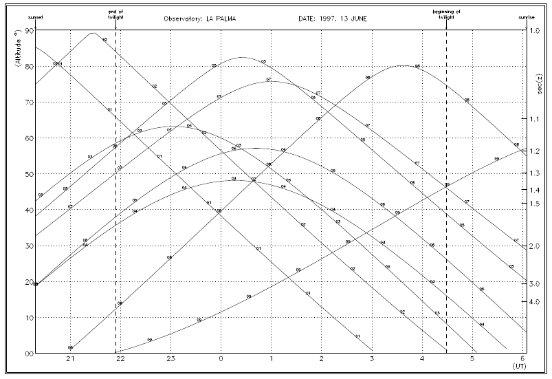
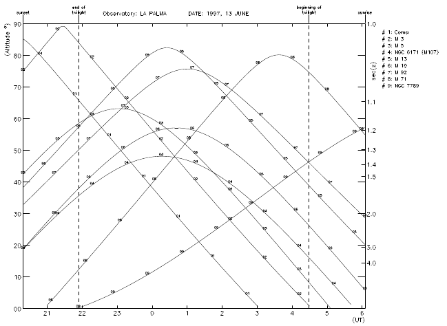

Running the program: an example
===============================

Starting
---------

The easiest way to learn how **proas** works is to follow this example (the distribution includes the file `sample.dat` used in this example). 

:: 

    $ proas
    
    ===============================================================================
    ===============================================================================
                                    Proas: planning of astronomical observations
                                    Version 18-December-1997, Nicolás Cardiel
                                    Departamento de Astrofisica, U.C.M.
    ===============================================================================
    ===============================================================================

Observer location
------------------

::

    ===============================================================================
    ENTER OBSERVATORY
    (0) Observatory data through keyboard (Longitude,Latitude,Height)
    (1) CALAR ALTO
    (2) EL TEIDE
    (3) MADRID
    (4) LA PALMA
    (5) SAN PEDRO
    (6) LICK
    (7) LA SILLA
    (8) UKIRT
    (9) McDonald
    Observatory number [4] ? 4

If your observatory is not included in this list, you must select option (0), and enter the new observatory name,
latitude (format DD.MMSS), longitude (format DD.MMSS), and height (metres).

::

    Observatory name (max. 15 characters)? Mount Everest
    Latitude (+DD.MMSS)? 27.5917
    Longitude (+DD.MMSS, +E, -W)? 86.5531
    Height (metres)? 8848

    
Coordinates of the objects to be observed
------------------------------------------

::

    ===============================================================================
    COORDINATES OF THE TARGET LIST:
    (1) enter object data through keyboard  
    (2) enter object data from file
    
The coordinates of the objects to be observed can be entered into the program either through the keyboard
or from an external file.

::

    option (1,...,2) [2] ? 1
    Object name (<end> to exit, max. 30 characters) [end] ? M 3
    Right ascension (HH.MMSS)?  12.2000
    Declination    (+GG.MMSS)? +28.2300
    Object name (<end> to exit, max. 30 characters) [end] ? end
    Do you want to create an output file with current object list (y/n) [n] ? n
    Total number of objects:    1
    
::

    option (1,...,2) [2] ? 2
    Object data file name? sample.dat
            Coma                12.2200     25.0000
            M 3                 13.4212     28.2300
            M 5                 15.1836     2.0500
            NGC 6171 (M107)     16.3230     -13.0300
            M 13                16.4142     36.2800
            M 10                16.5706     -4.0600
            M 92                17.1706     43.0800
            M 71                19.5348     18.4700
            NGC 7789            23.5700     56.4400
    Total number of objects: 9
       
This file could have been generated in an earlier **proas** session (by entering the data through the keyboard and
saving them into an output file), or by using any text editor. In this last case, remember that the format
of the file must be the following: a single line per object (maximum 80 characters), containing a text string
(maximum 30 characters), right ascension (format HH.MMSS) and declination (+DD.MMSS). These three
items must be separated by commas (obviously, the text string cannot contain any comma). Valid examples are:

::

    NGC 1123, 12.3417, -30.4509
    ABELL 2325 , 7.0323 ,12.4812
    M 101,9.0132,60.0159

Blank spaces can be left around the commas.
    
Equinox
--------

::

    ===============================================================================
    Equinox (for all the objects) [1950.0] ? 1950.000
    
This equinox will be employed for all the objects (the program does not currently allow to use different values for each
object).

Observing date
---------------

::

    ===============================================================================
    ENTER OBSERVING DATE:
    
    YEAR          ? 1997
    MONTH (number)? 6
    DAY           ? 13
    
    
In order to avoid confusions, when an observing night expands over two different days, the computed sunset
corresponds to the entered date.

Graphic output
---------------

::

    ===============================================================================
    (1) plot composite chart
    (2) plot only altitude vs UT from option (1)
    (3) plot altitude vs UT (draft)
    (4) change observing date
    (0) STOP
    
    Option  (0,...,4) [3] ? 4
    
Three different graphic options are currently available. An extra option (number 4), allows the user to change
the observing date without exiting from the program (but with the same target list).

::

    ===============================================================================
    (1) plot composite chart
    (2) plot only altitude vs UT from option (1)
    (3) plot altitude vs UT (draft)
    (4) change observing date
    (0) STOP
    
    Option (0,...,4) [3] ? 1
    No. of objects/plot (1,...,10) [10] ? 10
    ===============================================================================
    GRAPHIC OUTPUT:
    (1) /xserve (terminal)
    (2) /ps (PostScript)
    (3) show list with available graphic output devices
    Option (1,...,3) [1] ? 1

.. image:: images/proas1.png
   :scale: 80%
   :align: center

   
It is important to note that if you select the \ps (PostScript) option, the graphic output is sent to a file 
called `pgplot.ps`. Every time you choose this option, a new *pgplot.ps* file is created (and the previous one
overwritten). So, if you need to create different PostScript files in a single **proas** session, choose option (3) in
the last menu to indicate an output PostScript file with a different name, e.g.

::

    ===============================================================================
    GRAPHIC OUTPUT:
    (1) /xserve (terminal)
    (2) /ps (PostScript)
    (3) show list with available graphic output devices
    Option (1,...,3) [3] ? 3
    Graphics device/type (? to see list, default /XSERVE): myfile.ps/ps

::

    ===============================================================================
    (1) plot composite chart
    (2) plot only altitude vs UT from option (1)
    (3) plot altitude vs UT (draft)
    (4) change observing date
    (0) STOP
    Option (0,...,4) [3] ? 2
    No. of objects/plot ? 10
    ===============================================================================
    GRAPHIC OUTPUT:
    (1) /xserve (terminal)
    (2) /ps (PostScript)
    (3) show list with available graphic output devices
    Option (1,...,3) [1] ? 1

   
::

    ===============================================================================
    (1) plot composite chart
    (2) plot only altitude vs UT from option (1)
    (3) plot altitude vs UT (draft)
    (4) change observing date
    (0) STOP
    Option (0,...,4) [3] ? 3
    No. of objects/plot (1,...,40) [40] ? 10
    ===============================================================================
    GRAPHIC OUTPUT:
    (1) /xserve (terminal)
    (2) /ps (PostScript)
    (3) show list with available graphic output devices
    Option (1,...,3) [1] ? 1

   
Exiting from proas
-------------------

::

    ===============================================================================
    (1) plot composite chart
    (2) plot only altitude vs UT from option (1)
    (3) plot altitude vs UT (draft)
    (4) change observing date
    (0) STOP
    Option (0,...,4) [3] ? 0

